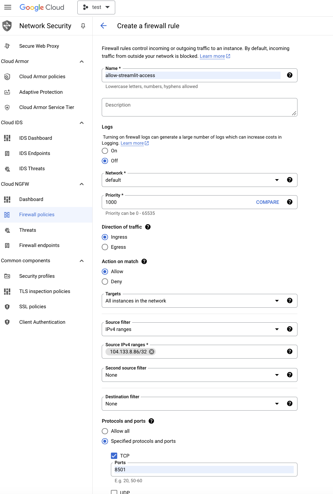

# Scence to Style:

This is a Streamlit app for furniture recommendations. Users can upload any type of video, and Gemini multimodal analysis evaluates it. If relevant, the app provides a range of furniture recommendations based on the style and architecture of the house. The Imagine model visualizes these recommendations, and Google Lens is used for users to search for items they like by image.

Please note that this is a work in progress. This version is for development and prototyping, running via the Workbench terminal.


# Project Setup Instructions

You need to have a GCP account in which the image generation model is activated (refer to this [link](https://cloud.google.com/vertex-ai/generative-ai/docs/image/overview)).

1. **Create a Workbench Instance**  
   Set up a Workbench instance with Python 3 as the environment.

2. **Configure Firewall Rules**  
   Ensure the firewall rules allow access to external IPs.

   

4. **Note Project ID and Service Account**  
   Record your project ID and instance service account. Then, run the `setup_gcloud` script as follows:
   ```bash
   ./setup_gcloud.sh <project_id> <service_account_email>
   ```

5. **Clone the Repository**  
   Open the Workbench (Jupyter Notebook) and run the following command in the terminal:
   ```bash
   !git clone https://github.com/AmirMK/scence-to-style.git
   ```

6. **Install Required Packages**  
   Install the necessary packages by running the following command in the workbench terminal:
   ```bash
   pip install -r requirements.txt
   ```
6. **Run the app**  
   Run the streamlit app the following command in the workbench terminal:
   ```bash
   streamlit run app.py
   ```
