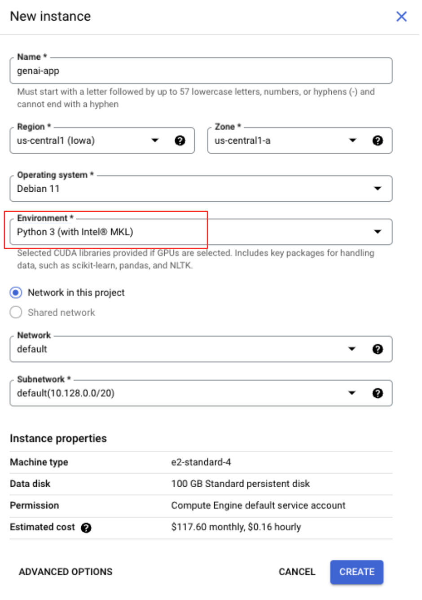
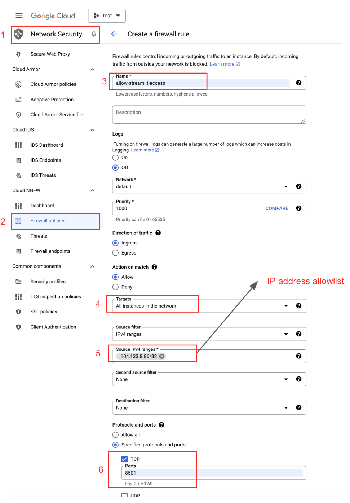
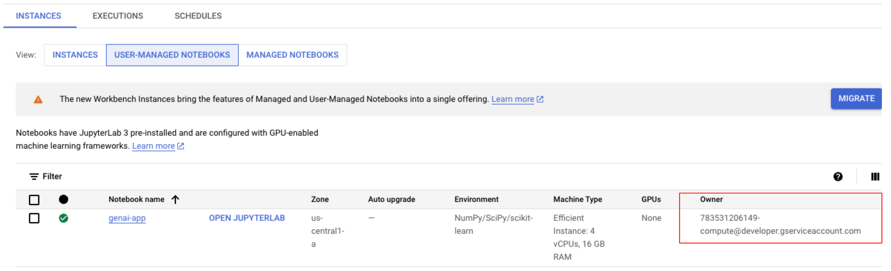
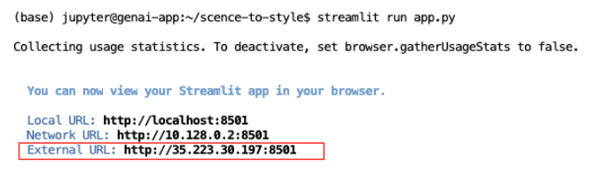

# Scence to Style:

This is a Streamlit app for furniture recommendations. Users can upload any type of video, and Gemini multimodal analysis evaluates it. If relevant, the app provides a range of furniture recommendations based on the style and architecture of the house. The Imagine model visualizes these recommendations, and Google Lens is used for users to search for items they like by image.

Please note that this is a work in progress. This version is for development and prototyping, running via the Workbench terminal.


# Project Setup Instructions

You need to have a GCP account in which the image generation model is activated (refer to this [link](https://cloud.google.com/vertex-ai/generative-ai/docs/image/overview)).

1. **Create a Workbench Instance**  
   Set up a Workbench instance with `Python 3.x` as the environment.
   
   

3. **Configure Firewall Rules**  
   Ensure the firewall rules allow access to external IPs.

   

4. **Enable Required Service and APIs**  
   Record your project ID and instance service account email:


   Go to GCP cloud shell 
   Download the `setup_gcloud` file:
   ```bash
   wget https://raw.githubusercontent.com/AmirMK/scence-to-style/main/setup_gcloud.sh
   ```
   Then, run the `setup_gcloud` script as follows from GCP cloud shell:
   ```bash
   chmod +x setup_gcloud.sh
   ./setup_gcloud.sh <project_id> <service_account_email>
   ```

5. **Creat a Google Storage Bucket**  
   The app uses this bukcet to store the recommendations. Run the below command on GCP cloud shell:
    ```bash
   gsutil mb gs://<your-bucket-name>
   ```


7. **Clone the Repository**  
   Open the Workbench (Jupyter Notebook) and run the following command in the workbench terminal:
   ```bash
   git clone https://github.com/AmirMK/scence-to-style.git
   ```

8. **Adjust the Configuration**  
   From the workbench terminal go `scence-to-style` folderto Open `Config.yaml` file in the workbench and adjust the project id, service account email and the bucket. 

9. **Install Required Packages**  
   Install the necessary packages by running the following command in the workbench terminal:
   ```bash
   pip install -r requirements.txt
   ```
10. **Run the app**  
   Run the streamlit app the following command in the workbench terminal:
   ```bash
   streamlit run app.py
   ```
   and use the external url to open the app in a separate browsers:
   
   

There are some sample videos [here](https://drive.google.com/drive/folders/1gydtdaMmtGANRW3nQ9W7ClV0F7d9MOoX?usp=drive_link) you can try as well as your own videos. 
   
